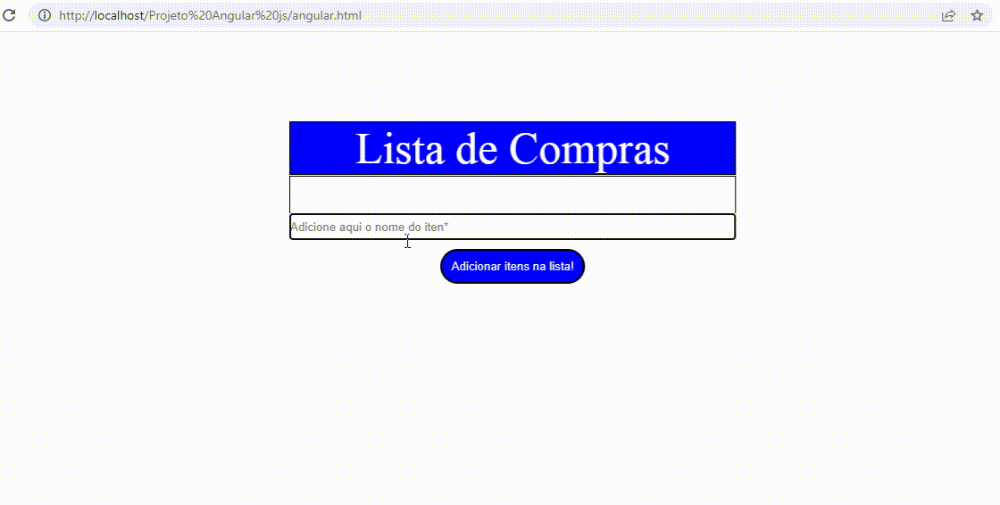

<h1 align="center">
 
  
 
 
Projeto Angular JS
</h1>

Projeto simpre de uma tabela de compras onde a inclusão e exclusão dos intens seja feita de uma forma dinamica e rapida.

  

[//]: # (Add your gifs/images here:)

  

## License

This project is licensed under the MIT License - see the [LICENSE](https://opensource.org/licenses/MIT) page for details.